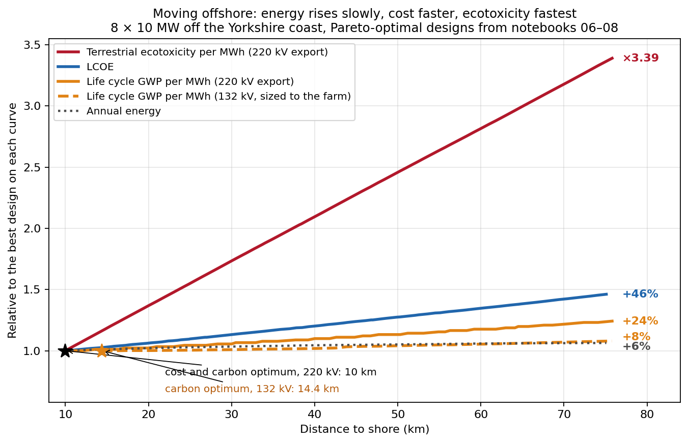
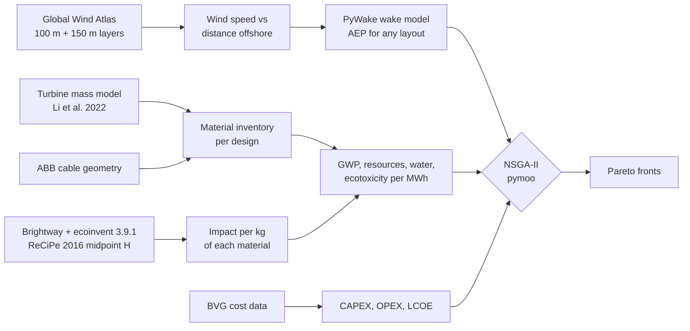
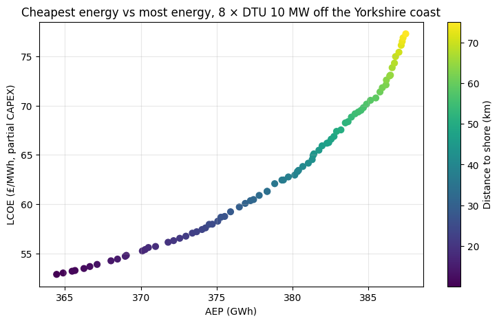
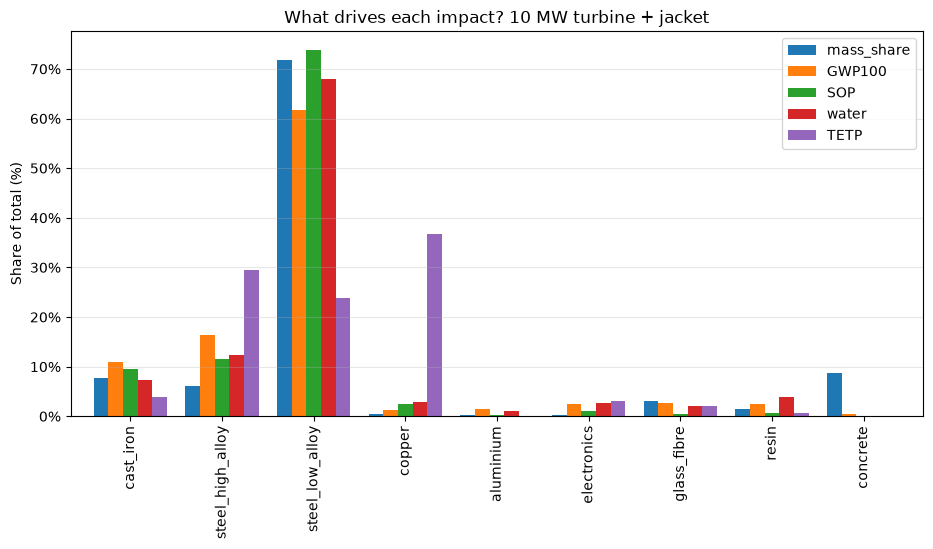
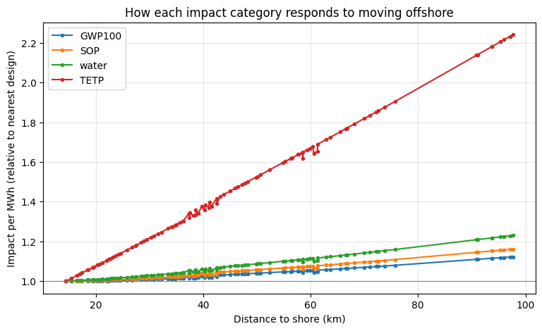
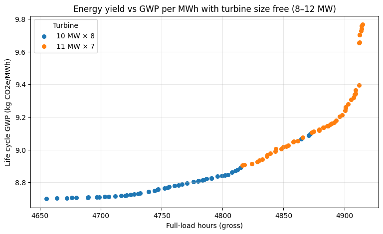

# Offshore wind farm design optimisation

Layout, siting, cost and life cycle impacts of an offshore wind farm, optimised together: PyWake wake modelling, NSGA-II search (pymoo) and Brightway life cycle assessment in one pipeline.

**How far offshore should an 80 MW wind farm be built when energy, cost, carbon and materials are all counted?**



### Results at a glance

8 × 10 MW turbines off the Yorkshire coast, moving from 10 km to 76 km offshore:

| | Change | Notebook |
|---|---|---|
| Annual energy | +6.3% | 06 |
| LCOE | +46% (£52.9 → £77.3/MWh) | 06 |
| Life cycle GWP per MWh | +24% | 07 |
| Terrestrial ecotoxicity per MWh | ×3.4 | 07 |
| Export cable's share of ecotoxicity at 50 km | 78% | 07 |
| Lowest-cost site | 10 km, the nearest allowed | 06 |
| Lowest-carbon site | 10 km with a 220 kV export cable; 14.4 km with a 132 kV cable sized to the farm | 07, 08 |

Moving offshore buys energy slowly and cost quickly. Carbon sits in between, and ecotoxicity, driven by the export cable's copper, rises fastest of all.

> **Scope.** A comparative design model, not a project finance or engineering design. Cable routing is a minimum spanning tree, energy is gross, and the LCA covers materials and processing only. Full list under [Limitations](#limitations).

**Start here:** [06 · Techno-economic siting](06_techno_economic_siting_optimisation.ipynb) for cost, [07 · Life cycle impacts](07_life_cycle_impacts_siting.ipynb) for the Brightway coupling. Notebooks 01–04 build up the wake and layout methods.

**Built with:** PyWake · TopFarm · pymoo (NSGA-II) · Brightway 2.5 · ecoinvent 3.9.1 · Global Wind Atlas

## What I built

The wake physics, optimiser and LCA engine are existing open-source tools. The model that connects them is mine:

- a siting model that moves the farm along a Global Wind Atlas transect, with wind speed at each distance interpolated to hub height from the 100 m and 150 m layers
- a turbine mass and material model for 8–12 MW turbines, fitted to published curves (Li et al. 2022) and checked against the DTU 10 MW reference turbine
- a subsea cable inventory (copper, lead, steel, XLPE per km) estimated from manufacturer geometry and validated against the listed cable weights
- a Brightway workflow that turns ecoinvent into impact factors per material class, coupled directly to the optimiser so every candidate design is scored for four impact categories
- a cost model (CAPEX, OPEX, discounted LCOE) built from BVG Associates' published figures
- the NSGA-II problem set-ups: design variables, objectives and constraints for layout, distance to shore and turbine size, run with pymoo

## How it fits together



Impacts are calculated once per material class (13 classes, four impact categories), so each candidate design is scored by multiplying masses by factors rather than running a new LCA. That keeps each evaluation cheap enough for 30,000 designs per run.

## Findings

### Siting beats layout, and cost rises much faster than energy

With 8 × 10 MW turbines, moving the farm from 10 km to 75 km offshore raises annual energy by 6.3% (364.4 → 387.5 GWh). Over the same distance LCOE rises from £52.9 to £77.3/MWh. Every extra MWh gained by moving offshore costs about £460, because the export cable is £2M per km for a farm of only 80 MW. Past 75 km the wind profile flattens (the transect peaks near 98 km, only 0.5% above its 75 km value) and further sites are dominated.

Layout still matters against a standard design: at 75 km the optimised layout gives 2.7% more energy than a regular 4 × 2 grid (387.5 vs 377.3 GWh) and cuts LCOE from £78.95 to £77.3/MWh.



The cost model covers turbines (£1.25M/MW), jacket foundations (£0.45M/MW), cables and OPEX, over 25 years at a 6.5% discount rate. BVG's full reference project is £3.47M/MW of CAPEX once development, the offshore substation, installation and contingency are added, so these LCOE values are for comparing designs with each other, not with auction prices.

### Where the impacts come from

A 10 MW turbine with a jacket comes to about 326 t of material per MW and 967 t CO2e per MW from materials and processing. Over 25 years at this site, that is about 8 g CO2e/kWh from turbine and foundation materials alone.

Low-alloy steel is 72% of the mass and 62% of the GWP. Copper is 0.5% of the mass and 37% of the terrestrial ecotoxicity; high-alloy steel, through its nickel and chromium, is 6% of the mass and another 29%.



The cables are where distance enters. Material per km was estimated from ABB cable geometry, and the copper figure checks out against the datasheets: the weight difference between the copper and aluminium versions of each cable matches the conductor mass to within 0.1 kg/m.

| Cable (three-core, lead-sheathed) | Copper | Lead | Steel armour | GWP100 | Terrestrial ecotoxicity |
|---|---|---|---|---|---|
| Array, 66 kV 3 × 400 mm² | 10.8 t/km | 8.2 t/km | 12.8 t/km | 158 t CO2e/km | 37,000 t 1,4-DCB/km |
| Export, 132 kV 3 × 300 mm² | 8.1 t/km | 12.8 t/km | 15.4 t/km | 163 t CO2e/km | 28,200 t 1,4-DCB/km |
| Export, 220 kV 3 × 1,000 mm² | 26.9 t/km | 30.0 t/km | 27.2 t/km | 407 t CO2e/km | 92,900 t 1,4-DCB/km |

Both export cables carry more lead than copper.

### Cost and carbon, with the same export cable

Notebook 07 keeps the notebook 06 farm (8 × 10 MW) and swaps LCOE for life cycle GWP per MWh, using the same 220 kV export cable that the £2M/km cost represents. The lowest-carbon design is then at the 10 km bound, like the cheapest one, at 9.1 kg CO2e/MWh. From there to 76 km, GWP per MWh rises 24% (9.1 → 11.3), against 46% for LCOE, on the same 6.3% gain in energy. The extra energy from moving offshore carries about 45 kg CO2e per MWh, roughly five times the near-shore average; for cost the same ratio is about nine.

The 220 kV cable is heavy: 27 t of copper, 30 t of lead and 27 t of steel per km, 407 t CO2e/km and 92,900 t 1,4-DCB/km. With the farm 50 km out, it is 21% of the farm's GWP, 27% of its mineral resource use, 32% of its water use and 78% of its terrestrial ecotoxicity. From 10 to 76 km, ecotoxicity per MWh rises 3.4-fold, water use 1.5-fold and mineral resource use 1.4-fold, against 1.24-fold for GWP.

### What happens with a cable sized to the farm

An 80 MW farm needs about 350 A at 132 kV, which a 3 × 300 mm² cable carries with margin. Notebook 08 uses that cable (163 t CO2e/km, 28,200 t 1,4-DCB/km). With it, each extra kilometre offshore adds less to the farm's GWP than the stronger wind adds to its energy, over the first few kilometres, and the lowest-carbon design moves off the bound to 8 × 10 MW at 14.4 km (8.70 kg CO2e/MWh). From there to 76 km, GWP per MWh rises 8% while full-load hours rise 5.5%. Terrestrial ecotoxicity per MWh roughly doubles over the same stretch (×1.9) and reaches ×2.2 by 98 km; water use rises 16% and mineral resource use about 10%.



So carbon, cost and materials only point to different sites when the export cable is right-sized, and even then the carbon optimum is only a few kilometres from the cost optimum. The larger gap is between GWP and ecotoxicity: a siting decision made on carbon says little about the copper and lead it commits.

### Turbine size

In notebook 08, letting turbine capacity vary from 8 to 12 MW (rotor diameter and hub height from the Li et al. regressions, a PyWake `GenericWindTurbine` for each size, and wind sheared to each hub height), the front alternates between 10 MW and 11 MW designs. The two differ by under 1% on both objectives, inside the uncertainty of the mass model, so the fair reading is that size is a weak lever in this range. The 12 MW designs never appear, partly because of how the farm is set up (see below).



## Limitations

- **Cable length** is a minimum spanning tree between turbines, a lower bound. Real arrays are limited by how many turbines each string can carry and where the substation sits.
- **One array cable size** (66 kV, 3 × 400 mm²) represents the whole array. Sizing each cable segment by the current it carries is the obvious next step, and the ABB ampacity tables are the data it needs.
- **Export cable:** notebooks 06 and 07 use a 220 kV cable, oversized for 80 MW but matching the £2M/km cost; notebook 08 uses the 132 kV cable sized to the farm. There is no 132 kV installed cost in the model yet, so the right-sized case has no LCOE counterpart.
- **Standalone farm:** 80 MW with its own export cable. Treating the array as a slice of a gigawatt-scale project, sharing a larger export cable, would weaken the pull towards the shore.
- **Turbine masses** come from power laws fitted to curves digitised from Li et al. (2022), Fig. S3, valid for about 8–12 MW. Against the published DTU 10 MW masses they are within −5% (nacelle), +15% (rotor) and −12% (tower).
- **Turbine-size study:** the lease area is fixed at 3 × 2 km while the farm varies between 77 and 84 MW, and both 11 MW and 12 MW round to seven turbines. Power density therefore changes with turbine size, and some of the 11 MW advantage comes from fewer turbines in the same area.
- **LCA scope:** materials and processing only. Installation vessels, O&M transport and end-of-life are not yet included; welding, blade manufacturing energy and armour galvanising are left out of the inventory.
- **Energy is gross:** wake losses are modelled, availability and electrical losses are not. Full-load hours of 4,655–4,915 correspond to a 53–56% gross capacity factor.
- **Wind:** only the mean wind speed changes with distance offshore; the wind rose shape is taken from the Dogger Bank point throughout.

## Notebooks

| | Notebook | What it does | |
|---|---|---|---|
| 01 | [Wake modelling, Horns Rev 1](01_wake_modelling_horns_rev.ipynb) | Wake losses for an 8 × V80 grid, one wind direction vs the full year | [](https://colab.research.google.com/github/Thashmikab/offshore-wind-layout-cable-tradeoff/blob/main/01_wake_modelling_horns_rev.ipynb) |
| 02 | [Layout optimisation, TopFarm](02_layout_optimisation_topfarm.ipynb) | Maximises AEP alone with gradient-based SLSQP | [](https://colab.research.google.com/github/Thashmikab/offshore-wind-layout-cable-tradeoff/blob/main/02_layout_optimisation_topfarm.ipynb) |
| 03 | [AEP vs cable, NSGA-II](03_aep_vs_cable_nsga2.ipynb) | Two-objective search: energy against inter-array cable length | [](https://colab.research.google.com/github/Thashmikab/offshore-wind-layout-cable-tradeoff/blob/main/03_aep_vs_cable_nsga2.ipynb) |
| 04 | [Dogger Bank](04_dogger_bank_real_site.ipynb) | The same problem with Global Wind Atlas data and DTU 10 MW turbines | [](https://colab.research.google.com/github/Thashmikab/offshore-wind-layout-cable-tradeoff/blob/main/04_dogger_bank_real_site.ipynb) |
| 05 | [Distance to shore](05_siting_distance_to_shore.ipynb) | Builds the Global Wind Atlas transect; distance offshore as a variable, energy vs array and export cable length | [](https://colab.research.google.com/github/Thashmikab/offshore-wind-layout-cable-tradeoff/blob/main/05_siting_distance_to_shore.ipynb) |
| 06 | [Techno-economic siting](06_techno_economic_siting_optimisation.ipynb) | Energy vs LCOE over layout and distance to shore | [](https://colab.research.google.com/github/Thashmikab/offshore-wind-layout-cable-tradeoff/blob/main/06_techno_economic_siting_optimisation.ipynb) |
| 07 | [Life cycle impacts](07_life_cycle_impacts_siting.ipynb) | Brightway + ecoinvent material factors, turbine and cable inventories, energy vs GWP per MWh with the 220 kV export cable | [](https://colab.research.google.com/github/Thashmikab/offshore-wind-layout-cable-tradeoff/blob/main/07_life_cycle_impacts_siting.ipynb) |
| 08 | [Turbine size](08_turbine_size_optimisation.ipynb) | Turbine capacity (8–12 MW) as a design variable alongside layout and distance, with a 132 kV export cable sized to the farm; all four impact categories along the front | [](https://colab.research.google.com/github/Thashmikab/offshore-wind-layout-cable-tradeoff/blob/main/08_turbine_size_optimisation.ipynb) |

Each notebook runs top to bottom in Colab. Notebooks 01–05 take minutes; the optimisation runs in 06–08 take much longer, and 08 (300 generations) can take over an hour, because every candidate design is evaluated against the full wind rose.

Notebook 07 needs an ecoinvent licence to run the Brightway part: add your credentials as Colab secrets named `ECOINVENT_USER` and `ECOINVENT_PASS`, and expect the database import to take 10–15 minutes. Without a licence, set `USE_BRIGHTWAY = False` and it runs from the published factors in `data/lca_factors_materials.csv`, which is also what notebook 08 reads. Only aggregated impact results are published here; no ecoinvent inventory data is included.

To run locally:

```bash
pip install -r requirements.txt
jupyter lab
```

## Data and sources

- Wind: Global Wind Atlas 3 (DTU / World Bank), used under its terms of use.
- Turbine size relations, component masses and material composition: Li, C. et al. (2022) Future material requirements for global sustainable offshore wind energy development. *Renewable and Sustainable Energy Reviews* 164, 112603.
- Cable geometry: ABB (2010) *XLPE Submarine Cable Systems*, rev. 5.
- Costs: BVG Associates (2025) *Guide to an Offshore Wind Farm*, 2024 prices.
- Life cycle inventory: ecoinvent 3.9.1, allocation at the point of substitution (APOS); impact method ReCiPe 2016 v1.03 midpoint (H).
- Reference turbine: Bak, C. et al. (2013) *Description of the DTU 10 MW Reference Wind Turbine*, DTU Wind Energy.
- Wake models: Bastankhah, M. & Porté-Agel, F. (2014), *Renewable Energy* 70; Niayifar, A. & Porté-Agel, F. (2016), *Energies* 9(9).
- Tools: PyWake and TopFarm (DTU Wind Energy), pymoo (Blank & Deb 2020), Brightway 2.5 (Mutel 2017).

## Roadmap

- [x] Wake modelling and single-objective layout optimisation (01–02)
- [x] Energy vs cable length with NSGA-II (03–04)
- [x] Global Wind Atlas transect and distance to shore as a variable (05)
- [x] Techno-economic siting and layout (06)
- [x] Brightway life cycle impacts coupled to the optimiser (07)
- [x] Turbine size as a design variable (08)
- [ ] Sourced installed cost for the 132 kV cable, so the right-sized case gets an LCOE front
- [ ] LCOE and GWP per MWh as two objectives on one front
- [ ] Vessel fuel for installation and O&M, which grows with distance
- [ ] Array cables sized segment by segment from the current each carries
- [ ] Turbine-size study at fixed power density

If you model array cables or offshore LCA and think a choice here is wrong (the MST proxy, the fixed lease area, how the export cable is allocated), open an issue or get in touch. I'd like to hear how you'd do it.

---

Thashmika Bandara, PhD candidate in Electrical Engineering, City St George's, University of London. The PhD looks at copper and other critical materials in UK renewable energy deployment; this repository is where that work meets wind farm design. · [LinkedIn](TODO)

Released under the MIT licence.
