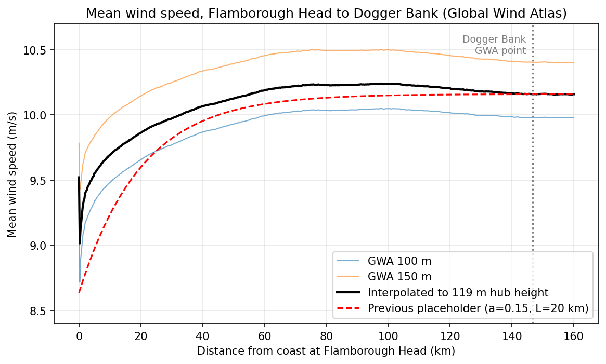

# Offshore wind farm design optimisation: PyWake, NSGA-II and Brightway

This project connects Brightway life cycle assessment, a material inventory for turbines and subsea cables, and a techno-economic cost model to offshore wind farm design optimisation. The wake physics is PyWake and TopFarm; the search is NSGA-II (pymoo). The same design variables (where each turbine sits, how far the farm is from shore, and in notebook 08 how big the turbines are) are scored for energy, levelised cost and life cycle impacts in one pipeline, so each result is a Pareto front rather than a single answer.

The test case is a small array off the Yorkshire coast, anywhere from 10 km out to the Dogger Bank, 147 km offshore. The most useful result so far is that cost and carbon disagree about where to build. LCOE is lowest right at the 10 km bound. Life cycle GWP per MWh is lowest further out, at about 15 km, because the turbines carry around 90% of the farm's GWP and the faster-rising near-shore wind spreads that fixed burden over more energy. For terrestrial ecotoxicity the picture changes again: the export cable's copper is the largest single source once the farm is a few tens of kilometres out.



## The pipeline

```
Global Wind Atlas (100 m + 150 m layers)  →  wind speed vs distance offshore
PyWake (Niayifar & Porté-Agel wake model)  →  annual energy for any layout and site
Turbine mass model (Li et al. 2022)        →  nacelle, rotor, tower, jacket masses for 8–12 MW
ABB cable datasheets                       →  copper, lead, steel, XLPE per km of cable
Brightway 2.5 + ecoinvent 3.9.1 (APOS)     →  impact per kg of each material, ReCiPe 2016 midpoint (H)
Cost model (BVG Associates 2025)           →  CAPEX, OPEX, LCOE
NSGA-II (pymoo)                            →  Pareto fronts: energy vs LCOE, energy vs GWP
```

Brightway is called directly from the optimisation notebook. Impacts are calculated once per material class (13 classes, four impact categories), so each candidate design is scored by multiplying masses by factors rather than by running a new LCA. That keeps each evaluation cheap enough for 30,000 designs per run.

## Findings

### Siting beats layout, and cost rises much faster than energy

With 8 × 10 MW turbines, moving the farm from 10 km to 75 km offshore raises annual energy by 6.3% (364.4 → 387.5 GWh). Over the same distance LCOE rises from £52.9 to £77.3/MWh. Every extra MWh gained by moving offshore costs about £460, because the export cable is £2M per km for a farm of only 80 MW. Past 75 km the wind profile flattens (the transect peaks near 98 km, only 0.5% above its 75 km value) and further sites are dominated.

Layout still matters against a standard design: at 75 km the optimised layout gives 2.7% more energy than a regular 4 × 2 grid (387.5 vs 377.3 GWh) and cuts LCOE from £78.95 to £77.3/MWh.


The cost model covers turbines (£1.25M/MW), jacket foundations (£0.45M/MW), cables and OPEX, over 25 years at a 6.5% discount rate. BVG's full reference project is £3.47M/MW of CAPEX once development, the offshore substation, installation and contingency are added, so these LCOE values are for comparing designs with each other, not with auction prices.

### Where the impacts come from

A 10 MW turbine with a jacket comes to about 326 t of material per MW and 967 t CO2e per MW from materials and processing. Over 25 years at this site, that is about 8 g CO2e/kWh from turbine and foundation materials alone.

Low-alloy steel is 72% of the mass and 62% of the GWP. Copper is 0.5% of the mass and 37% of the terrestrial ecotoxicity; high-alloy steel, through its nickel and chromium, is 6% of the mass and another 29%.


The cables are where distance enters. Material per km was estimated from ABB cable geometry, and the copper figure checks out against the datasheets: the weight difference between the copper and aluminium versions of each cable matches the conductor mass to within 0.1 kg/m.

| Cable (three-core, lead-sheathed) | Copper | Lead | Steel armour | GWP100 | Terrestrial ecotoxicity |
|---|---|---|---|---|---|
| Array, 66 kV 3 × 400 mm² | 10.8 t/km | 8.2 t/km | 12.8 t/km | 158 t CO2e/km | 37,000 t 1,4-DCB/km |
| Export, 132 kV 3 × 300 mm² | 8.1 t/km | 12.8 t/km | 15.4 t/km | 163 t CO2e/km | 28,200 t 1,4-DCB/km |

The export cable carries more lead than copper. With the farm 50 km offshore, the eight turbines are 90% of its GWP and the export cable 9%. For terrestrial ecotoxicity the export cable is 52%, more than all eight turbines combined.

### Cost and carbon point to different sites

With turbine size, layout and distance all free and GWP per MWh as the objective, the lowest-carbon design is 8 × 10 MW at 14.7 km offshore, at 8.7 kg CO2e/MWh. It is not at the 10 km bound where LCOE is lowest. From there to 76 km, GWP per MWh rises by 8% while full-load hours rise by 5.6%. Terrestrial ecotoxicity per MWh roughly doubles over the same stretch (×1.9), and reaches ×2.2 by 97 km, because it follows the export cable's copper rather than the turbines' steel. Water use rises 16% and mineral resource use 10%.


A design chosen on carbon alone would not be the one chosen on materials, and neither is the one chosen on cost.

### Turbine size

Letting turbine capacity vary from 8 to 12 MW (rotor diameter and hub height from the Li et al. regressions, a PyWake `GenericWindTurbine` for each size, and wind sheared to each hub height), the front alternates between 10 MW and 11 MW designs. The two differ by under 1% on both objectives, inside the uncertainty of the mass model, so the fair reading is that size is a weak lever in this range. The 12 MW designs never appear, partly because of how the farm is set up (see below).


## Limitations

- **Cable length** is a minimum spanning tree between turbines, a lower bound. Real arrays are limited by how many turbines each string can carry and where the substation sits.
- **One array cable size** (66 kV, 3 × 400 mm²) represents the whole array. Sizing each cable segment by the current it carries is the obvious next step, and the ABB ampacity tables are the data it needs.
- **Export cable:** the cost model prices export cable at £2M/km, a 220 kV-class figure, while the LCA uses a 132 kV cable suited to an 80 MW farm. Aligning the two comes before the cost-vs-carbon comparison notebook.
- **Standalone farm:** 80 MW with its own export cable. Treating the array as a slice of a gigawatt-scale project, sharing a larger export cable, would weaken the pull towards the shore.
- **Turbine masses** come from power laws fitted to curves digitised from Li et al. (2022), Fig. S3, valid for about 8–12 MW. Against the published DTU 10 MW masses they are within −5% (nacelle), +15% (rotor) and −12% (tower).
- **Turbine-size study:** the lease area is fixed at 3 × 2 km while the farm varies between 77 and 84 MW, and both 11 MW and 12 MW round to seven turbines. Power density therefore changes with turbine size, and some of the 11 MW advantage comes from fewer turbines in the same area.
- **LCA scope:** materials and processing only. Installation vessels, O&M transport and end-of-life are not yet included; welding, blade manufacturing energy and armour galvanising are left out of the inventory.
- **Energy is gross:** wake losses are modelled, availability and electrical losses are not. Full-load hours of 4,650–4,915 correspond to a 53–56% gross capacity factor.
- **Wind:** only the mean wind speed changes with distance offshore; the wind rose shape is taken from the Dogger Bank point throughout.

## Notebooks

| | Notebook | What it does | |
|---|---|---|---|
| 01 | [Wake modelling, Horns Rev 1](01_wake_modelling_horns_rev.ipynb) | Wake losses for an 8 × V80 grid, one wind direction vs the full year | [](https://colab.research.google.com/github/Thashmikab/offshore-wind-layout-cable-tradeoff/blob/main/01_wake_modelling_horns_rev.ipynb) |
| 02 | [Layout optimisation, TopFarm](02_layout_optimisation_topfarm.ipynb) | Maximises AEP alone with gradient-based SLSQP | [](https://colab.research.google.com/github/Thashmikab/offshore-wind-layout-cable-tradeoff/blob/main/02_layout_optimisation_topfarm.ipynb) |
| 03 | [AEP vs cable, NSGA-II](03_aep_vs_cable_nsga2.ipynb) | Two-objective search: energy against inter-array cable length | [](https://colab.research.google.com/github/Thashmikab/offshore-wind-layout-cable-tradeoff/blob/main/03_aep_vs_cable_nsga2.ipynb) |
| 04 | [Dogger Bank](04_dogger_bank_real_site.ipynb) | The same problem with Global Wind Atlas data and DTU 10 MW turbines | [](https://colab.research.google.com/github/Thashmikab/offshore-wind-layout-cable-tradeoff/blob/main/04_dogger_bank_real_site.ipynb) |
| 05 | [Distance to shore](05_siting_distance_to_shore.ipynb) | Builds the Global Wind Atlas transect; distance offshore as a variable, energy vs array and export cable length | [](https://colab.research.google.com/github/Thashmikab/offshore-wind-layout-cable-tradeoff/blob/main/05_siting_distance_to_shore.ipynb) |
| 06 | [Techno-economic siting](06_techno_economic_siting_optimisation.ipynb) | Energy vs LCOE over layout and distance to shore | [](https://colab.research.google.com/github/Thashmikab/offshore-wind-layout-cable-tradeoff/blob/main/06_techno_economic_siting_optimisation.ipynb) |
| 07 | [Life cycle impacts](07_life_cycle_impacts_siting.ipynb) | Brightway + ecoinvent material factors, turbine and cable inventories, energy vs GWP per MWh | [](https://colab.research.google.com/github/Thashmikab/offshore-wind-layout-cable-tradeoff/blob/main/07_life_cycle_impacts_siting.ipynb) |
| 08 | [Turbine size](08_turbine_size_optimisation.ipynb) | Turbine capacity (8–12 MW) as a design variable alongside layout and distance; all four impact categories along the front | [](https://colab.research.google.com/github/Thashmikab/offshore-wind-layout-cable-tradeoff/blob/main/08_turbine_size_optimisation.ipynb) |

Each notebook runs top to bottom in Colab. The optimisation notebooks take several minutes to over an hour, since every candidate is evaluated against the full wind rose.

Notebook 07 needs an ecoinvent licence to run the Brightway part: add your credentials as Colab secrets named `ECOINVENT_USER` and `ECOINVENT_PASS`, and expect the database import to take 10–15 minutes. Without a licence, set `USE_BRIGHTWAY = False` and it runs from the published factors in `data/lca_factors_materials.csv`, which is also what notebook 08 reads. Only aggregated impact results are published here; no ecoinvent inventory data is included.

To run locally:

```bash
pip install -r requirements.txt
jupyter lab
```

## Data and sources

- Wind: Global Wind Atlas 3 (DTU / World Bank), used under its terms of use.
- Turbine size relations, component masses and material composition: Li, C. et al. (2022) Future material requirements for global sustainable offshore wind energy development. *Renewable and Sustainable Energy Reviews* 164, 112603.
- Cable geometry: ABB (2010) *XLPE Submarine Cable Systems*, rev. 5.
- Costs: BVG Associates (2025) *Guide to an Offshore Wind Farm*, 2024 prices.
- Life cycle inventory: ecoinvent 3.9.1, allocation at the point of substitution (APOS); impact method ReCiPe 2016 v1.03 midpoint (H).
- Reference turbine: Bak, C. et al. (2013) *Description of the DTU 10 MW Reference Wind Turbine*, DTU Wind Energy.
- Wake models: Bastankhah, M. & Porté-Agel, F. (2014), *Renewable Energy* 70; Niayifar, A. & Porté-Agel, F. (2016), *Energies* 9(9).
- Tools: PyWake and TopFarm (DTU Wind Energy), pymoo (Blank & Deb 2020), Brightway 2.5 (Mutel 2017).

## What's next

The next notebook puts LCOE and GWP per MWh on the same front, once the export cable is the same in both models. After that: vessel fuel for installation and O&M, which grows with distance and may pull the carbon optimum back towards the shore; per-segment array cable sizing; a fixed power density in the turbine-size study; and a unit-cell version of the farm.

If you model array cables or offshore LCA and think a choice here is wrong (the MST proxy, the fixed lease area, how the export cable is allocated), open an issue or get in touch. I'd like to hear how you'd do it.

---

Thashmika Bandara, PhD candidate in Electrical Engineering, City St George's, University of London. The PhD looks at copper and other critical materials in UK renewable energy deployment; this repository is where that work meets wind farm design. · [LinkedIn](TODO)

Released under the MIT licence.
